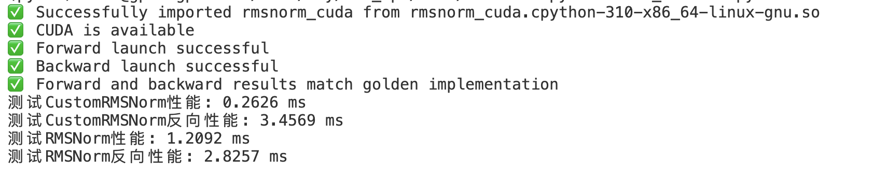

# 项目介绍
本项目是一个算子仓库，用于加速PyTorch实现。

# 算子类别
## RMSNORM算子

### 使用介绍
```
cd cuda/rmsnorm
python setup.py build_ext --inplace
python test_rmsnorm.py
```



### 优化介绍
开箱性能如上图所示，该算子在PyTorch中实现的RMSNorm算子快了约10倍。接下来本文主要介绍如何在目前的基础上优化性能。